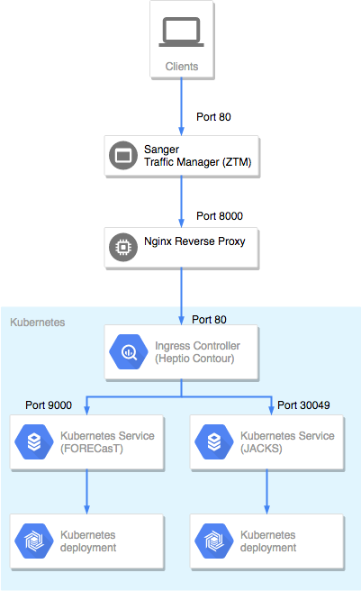

# Web

## Ingress controller

We use [heptio/contour](https://github.com/heptio/contour) as an Ingress Controller. Ingress controller is a reverse proxy server inside a Kubernetes cluster that allows to manage all services in one configuration file without exposing them each individually.

To install `contour` on the cluster, the only thing you need to run is 
```
kubectl apply -f https://j.hept.io/contour-deployment-rbac
```
Then activate ingress rules (it's a good idea to review this file first)
```
kubectl apply -f sanger/ingress/ingress-default.yaml
```

## Nginx proxy

We run an Nginx reverse proxy in front of our web services for two reasons:

* to manage HTTPS certificates in a centralized way
* to expose web sites publicly 

Sanger's gate keeper can only listen to applications running on ports 8000-8009, while ingress controllers can only serve on ports 80/443. Thus, we need an intermediate port forwarding layer.



Currently, our Nginx proxy is hosted on a separate Ubuntu instance, so changing the Kubernetes cluster with apps does not affect the reverse proxy.

Setup instruction is the following, though I don't vouch for its reproducability. It is based on this article:
https://www.linode.com/docs/web-servers/nginx/use-nginx-reverse-proxy/. Applicable to Ubuntu machines

```
sudo apt update
sudo apt install nginx
sudo systemctl start nginx
sudo systemctl enable nginx

# only if there are no certificates or to renew the old ones
sudo apt-get update
sudo apt-get install software-properties-common
sudo add-apt-repository ppa:certbot/certbot
sudo apt-get update
sudo apt-get install python-certbot-nginx
sudo certbot --nginx --cert-name cellgeni.sanger.ac.uk

# follow the interactive stuff
sudo nginx -s reload
```

Wildcard certificates for `*.cellgeni.sanger.ac.uk` were obtained through a DNS txt challenge, they are available [here](https://gitlab.internal.sanger.ac.uk/cellgeni/kubespray/tree/master/sanger/nginx)

To renew certificates, run
```
sudo certbot certonly --manual -d *.cellgeni.sanger.ac.uk
```
then follow the interactive program. Put the according string for the DNS challenge inside the external view on _acme-challenge.cellgeni.sanger.ac.uk at Infoblox.

To access the current server with nginx, download [nginx-keypair](https://gitlab.internal.sanger.ac.uk/cellgeni/kubespray/tree/master/sanger/ubuntu-keypair) to your local `.ssh` folder and run
```
ssh -i ~/.ssh/nginx-keypair ubuntu@172.27.16.131
```

After every change to Nginx run `sudo nginx -s reload`.

Configuration files for all web services are located in `/etc/nginx/conf.d/`. Add all files from `sanger/nginx/*.conf` (apart from `nginx.conf`) in this directory and reload nginx.

For a fresh setup, modify the main nginx configuration file, `/etc/nginx/nginx.conf`: add `client_max_body_size 10000M;` to the `http` section; copy SSL certificates to     `/etc/letsencrypt/live/cellgeni.sanger.ac.uk/` and modify accordingly - see `sanger/nginx/nginx.conf`.


## Web sites

#### [FORECasT](https://github.com/cellgeni/FORECasT)

Follow the instructions in the [README](https://github.com/cellgeni/FORECasT#with-kubernetes)

#### [JACKS](https://github.com/felicityallen/JACKS)

```
git clone https://github.com/felicityallen/JACKS
cd JACKS/server/k8s
kubectl apply -f deployment.yaml
kubectl apply -f pv.yaml
kubectl apply -f pvc.yaml
kubeclt apply -f service.yaml
```

#### [Scfind](https://github.com/hemberg-lab/scfind-shiny)

Currently hosted on a dedicated instance, later files from `sanger/sites/scfind` can be applied.

#### [Asthma](https://github.com/cellgeni/asthma)

Shiny apps behave inconsistenly in Kubernetes for some reason, so for now they are hosted on a separate instance. To access this instance, run the following:

```
# access the server with Nginx first
ssh -i ~/.ssh/nginx-keypair ubuntu@172.27.16.131

# access the server with shiny apps, the only reason why
# we do it from nginx server is because 192.168.252.29 is 
# an internal openstack IP, but it can be done from any openstack instance
ssh -i ~/.ssh/anton-k8s-keypair ubuntu@192.168.252.29

# download the dataset from where it resides, the link can be different
wget https://transfer.sh/HHclH/dataset.RDS
mv dataset.RDS /data/
docker run -d -p 8001:3838 -v /data:/data quay.io/cellgeni/asthma:v0.1.1
```
Later files from `sanger/sites/asthma` can be applied.

#### [Sample tracker](https://github.com/cellgeni/samples-tracker/tree/master/conf/k8s)

We need to create secrets in Kubernetes first. Download them internally from [Gitlab](https://gitlab.internal.sanger.ac.uk/cellgeni/kubespray/tree/master/sanger/sites/secrets.yaml) and run

```
kubectl create -f secrets.yaml --save-config
```

Then run
```
git clone https://github.com/cellgeni/samples-tracker/
cd samples-tracker/conf/k8s
kubectl apply -f app.yaml
kubectl apply -f service.yaml
```
